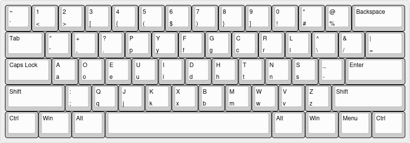

## Motivation
This is a modification of a The Real Programmer's Dvorak optimized slightly for my own personal uses, which involve writing both for programming and for mathematics.

## Why Dvorak?
Dvorak comes on evey major OS.

## Why change programmers Dvorak?
The major probles around PD is that it has a poorly thought out symbol layout.

## Why change the real programmer's Dvorak?
The major problem around RPD is that it wasn't designed for me personally.

I used [keyboard-layout-editor](https://keyboard-layout-editor.com/) to set up the layout and generate the images below.

[Here](https://keyboard-layout-editor.com/##@@=~%0A%60&=1%0A%3C&=2%0A%3E&=3%0A%5B&=4%0A%7B&=5%0A(&=6%0A$&=7%0A)&=8%0A%7D&=9%0A%5D&=0%0A!&=*%0A%23&=%2F@%0A%25&_w:2%3B&=Backspace%3B&@_w:1.5%3B&=Tab&=%22%0A'&=+%0A,&=%3F%0A.&=P%0Ap&=Y%0Ay&=F%0Af&=G%0Ag&=C%0Ac&=R%0Ar&=L%0Al&=%5E%0A%5C&=%2F&%0A%2F%2F&_w:1.5%3B&=%7C%0A%2F=%3B&@_w:1.75%3B&=Caps%20Lock&=A%0Aa&=O%0Ao&=E%0Ae&=U%0Au&=I%0Ai&=D%0Ad&=H%0Ah&=T%0At&=N%0An&=S%0As&=%2F_%0A-&_w:2.25%3B&=Enter%3B&@_w:2.25%3B&=Shift&=%2F:%0A%2F%3B&=Q%0Aq&=J%0Aj&=K%0Ak&=X%0Ax&=B%0Ab&=M%0Am&=W%0Aw&=V%0Av&=Z%0Az&_w:2.75%3B&=Shift%3B&@_w:1.25%3B&=Ctrl&_w:1.25%3B&=Win&_w:1.25%3B&=Alt&_a:7&w:6.25%3B&=&_a:4&w:1.25%3B&=Alt&_w:1.25%3B&=Win&_w:1.25%3B&=Menu&_w:1.25%3B&=Ctrl) is a link to the layout in case you want to make your own changes.

## Preview 

